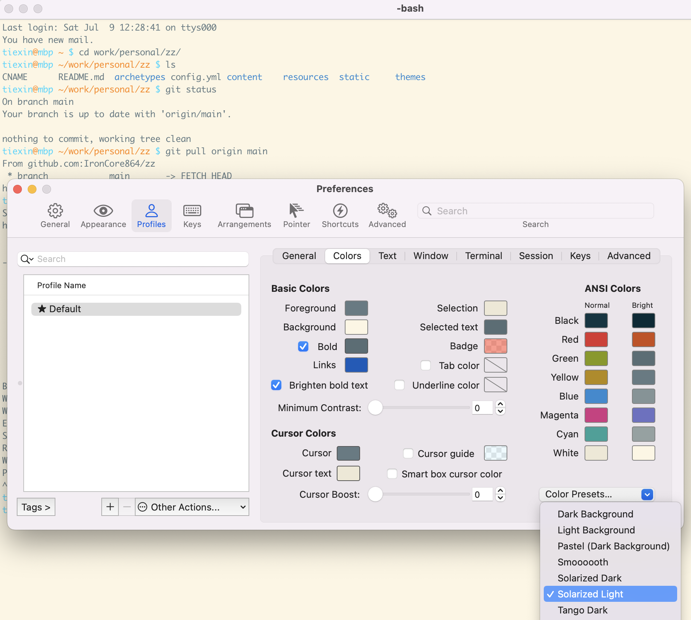
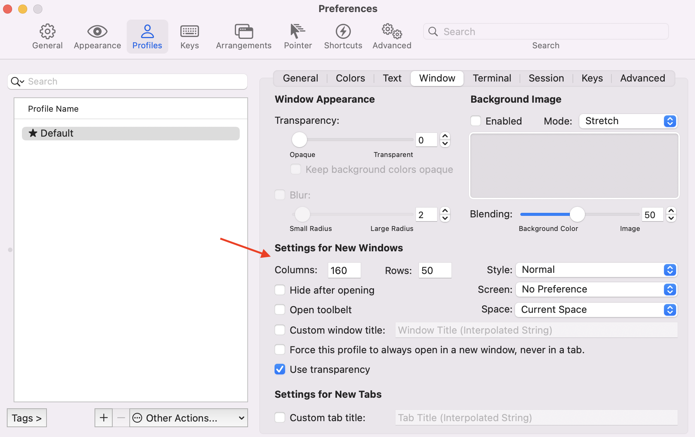
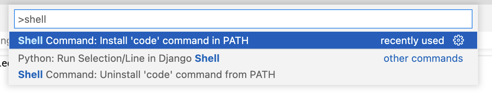
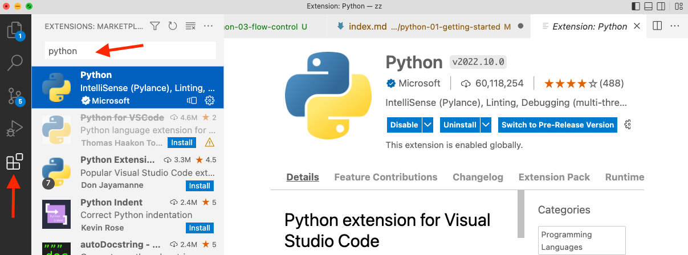
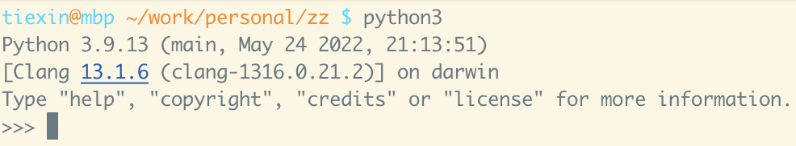
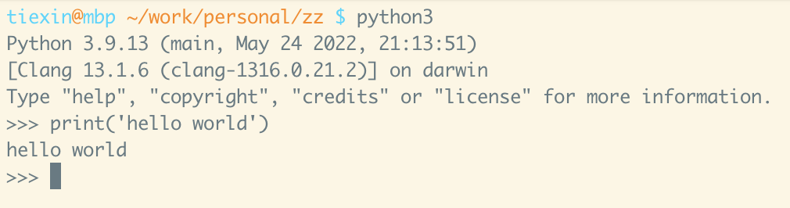

## 0 Whetting Your Appetite

If you do a lot of work on computers, eventually, you will find that there's some task you'd like to automate.

For example, you may wish to perform a search-and-replace over a large number of text files, or rename and rearrange a bunch of photo files in a complicated way.

Python is the language for you.

Python is simple to use, but it is a real programming language, offering much more structure and support for large programs, than "scripting language" or tools that support a bit of programming (Excel, for example.)

Python allows you to split your program into _modules_ that can be reused in other Python programs. It comes with a large collection of standard modules that you can use as the basis of your programs — or as examples to start learning to program in Python.

Python is an _interpreted_ (compared to compiled language) language, which can save you considerable time during program development because no compilation is necessary. The interpreter can be used interactively, which makes it easy to experiment with features of the language, write throw-away programs, or test functions during bottom-up program development. It is also a handy desk calculator.

Python enables programs to be written compactly and readably. Programs written in Python are typically much shorter than equivalent programs in other languages.

Now that you are excited about Python, you'll want to examine it in some more detail. Since the best way to learn a language is to use it, the tutorial invites you to play with the Python interpreter as you read.

For all the code examples, it's encouraged to run it yourself and have a feeling about them.

Without furthur adieu, let's go!

---

## 1 Install Python

We can use `brew` to install Python on macOS.

`brew` is a "package manager," which can be used to install packages (software.)

If you haven't installed `brew` on your mac yet, open the Terminal app that comes with your mac, and run:

```shell
/bin/bash -c "$(curl -fsSL https://raw.githubusercontent.com/Homebrew/install/HEAD/install.sh)"
```

Once you have `brew` installed, you can install Python by running the following command in your terminal:

```shell
brew install python
```

To verify you have successfully installed, execute the following commands:

```shell
$ which python3
/opt/homebrew/bin/python3
$ python3 --version
Python 3.9.12
```

and you should see `python3` is located at `/opt/homebrew/bin/python3`, and its version is `3.x.x`.

If you have already installed Python with `brew` before but want to upgrade your Python to the latest version, run:

```shell
brew upgrade python
```

---

## 2 Right Tools for the Job

While the default Terminal app that comes with your mac is OK, it's far from the best. 

The best is [iTerm2](https://iterm2.com/).

Follow the link to download, and move it to your "Applications" folder. Once installed, go to the "preferences" menu, in the "profile" tab, under the "colors" sub-tab, choose your favorite color preset:



Then in the "window" sub-tab, change the "columns" and "rows" in the "settings for new windows" section. FYI, my favorite value is 160 columns, 50 rows:



Next, let's choose a tool to edit Python source code files.

Popular choices are [Visual Studio Code (VS Code)](https://code.visualstudio.com/), and [PyCharm](https://www.jetbrains.com/pycharm/). Due to the extendability, VS Code is recommended.

Of course, you can use any other integrated development environment (IDE) tools or text editors (like `vim`.)

We will download, install and configure VSCode:

Download using the link above, and fire it up.

The shortcut for opening the command palette is `cmd + shift + p`. Press these three keys simultaneously, and type "shell":



After this, you can open a file with VSCode in iTerm. For example, if you run `code .` inside a directory in iTerm, VSCode can be started with the files in that directory.

Then let's install the Python plugin for VSCode. In the left side bar, choose "Extensions," search for Python, and install it:



---

## 3 Using the Python Interpreter

Let's start by using the Python interpreter's _Interactive Mode_. Open your iTerm, then run:



The three "greater than" sign (>>>) is the primary prompt, which prompts that here you can input the next command.

Let's run your first-ever Python code. Input `print('Hello, world!')` then press enter:



Congratulations! (Although this didn't do much other than printing the words "hello world" on the monitor.)

FYI, it's possible to input multiple lines of code in the interactive mode. The first line is started by the >>> primary prompt, and the continuation lines start by three dots (...):

```python3
>>> the_world_is_flat = True
>>> if the_world_is_flat:
...     print("Be careful not to fall off!")
...
Be careful not to fall off!
```

---

## Summary

After this very first post of my Python tutorial series, you should know the following:

- what Python is and why it's great
- how to install a Python interpreter on macOS
- install iTerm and Visual Studio Code, and the initial settings for them
- starting Python interpreter in interactive mode

In the next article, we will do an informal intro to Python by showing you how to use Python as a calculator, how to use strings, numbers, and lists, then start the very first step of programming by learning the Fibonacci sequence.
