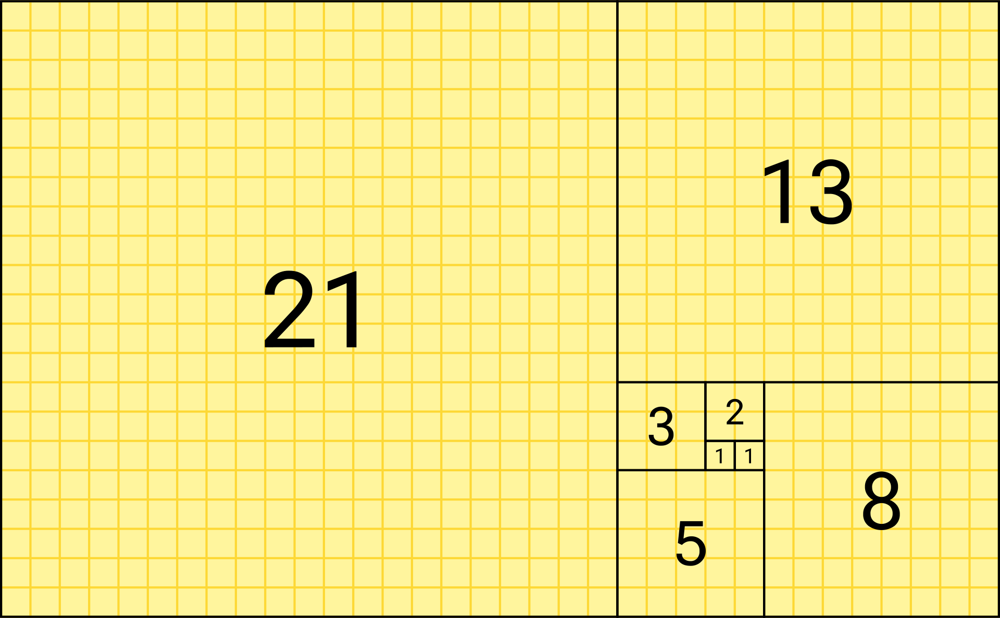

> To repeat the examples in this tutorial, you must type everything after the prompt (>>>) in the interactive mode, when the prompt appears; lines that do not begin with a prompt are output from the interpreter.

> Note that a secondary prompt on a line by itself in an example means you must type a blank line; this is used to end a multi-line command.

## 0 Comments

Start the interpreter and wait for the primary prompt (>>>).

```python
>>> # this is the first comment
>>> spam = 1  # and this is the second comment
>>> # ... and now a third!
>>> text = "# This is not a comment because it's inside quotes."
>>> text
"# This is not a comment because it's inside quotes."
```

_Note: in the interactive mode, if you input the name of a variable (like the `text` from the above example) and press enter, the value will be printed._

---

## 1 Python as a Calculator: Dealing with Numbers

Let's try some simple Python commands.

The interpreter can act as a simple calculator: you can type an _expression_ and it will calculate and print the value.

Expression syntax is straightforward: you can use the operators `+`, `-`, `*`, and `/`:

```python
>>> 2 + 2
4
>>> 50 - 5*6
20
>>> (50 - 5*6) / 4
5.0
>>> 8 / 5  # division always returns a floating point number
1.6
>>>
>>> 17 // 3  # floor division discards the fractional part
5
>>> 17 % 3  # the % operator returns the remainder of the division
2
```

An _expression_ contains only:

- Identifiers: variable names, functions, etc.
- Literals: raw data assigned to variables, for example: 'a' is a string literal, 9 is a number literal.
- Operators: `+`, `-`, `*`, `/`, etc.

An expression can be evaluated to a value (e.g., `5+9` is an expression because it evaluates to `14`.)

A _statement_ is everything that can make up a line (or several lines) of Python code.

_Note that expressions are statements as well._

Use the `**` operator to calculate powers:

```python
>>> 5 ** 2  # 5 squared
25
>>> 2 ** 7  # 2 to the power of 7
128
```

The equal sign `=` is used to assign a value to a variable.

In the interactive mode, after value assignment, no result will be displayed/printed:

```python
>>> width = 20
>>> height = 5 * 9
>>> width * height
900
```

If a variable is not "defined" (assigned a value), trying to access it will give you an error:

```python
>>> n  # try to access an undefined variable
Traceback (most recent call last):
  File "<stdin>", line 1, in <module>
NameError: name 'n' is not defined
```

We can also use floating point for calculation. If we operate an `int` with a `float`, we get a `float` result:

```python
>>> 4 * 3.75 - 1
14.0
```

---

## 2 Strings

Besides numbers, Python can also manipulate strings.

Strings can be enclosed in single quotes, like `'abc'`, or double quotes, like `"abc"`, and they are the same.

"\" can be used to escape quotes.

Examples:

```python
>>> 'spam eggs'  # single quotes
'spam eggs'
>>> 'doesn\'t'  # use \' to escape the single quote...
"doesn't"
>>> "doesn't"  # ...or use double quotes instead
"doesn't"
>>> '"Yes," they said.'
'"Yes," they said.'
>>> "\"Yes,\" they said."
'"Yes," they said.'
>>> '"Isn\'t," they said.'
'"Isn\'t," they said.'
```

> In the interactive interpreter, the output string is enclosed in quotes and special characters are escaped with backslashes. While this might sometimes look different from the input (the enclosing quotes could change), the two strings are equivalent. The string is enclosed in double quotes if the string contains a single quote and no double quotes, otherwise, it is enclosed in single quotes. The `print()` function produces a more readable output, by omitting the enclosing quotes and by printing escaped and special characters:

```python
>>> '"Isn\'t," they said.'
'"Isn\'t," they said.'
>>> print('"Isn\'t," they said.')
"Isn't," they said.
>>> s = 'First line.\nSecond line.'  # "\n" means newline
>>> s  # without print(), "\n" is included in the output
'First line.\nSecond line.'
>>> print(s)  # with print(), "\n" produces a new line
First line.
Second line.
```

If you don't want characters prefaced by `\` to be interpreted as special characters, you can use _raw strings_ by adding an `r` before the first quote:

```python
>>> print('C:\some\name')  # here \n means newline!
C:\some
ame
>>> print(r'C:\some\name')  # note the r before the quote
C:\some\name
```

String literals can span multiple lines. One way is using triple-quotes: `"""..."""` or `'''...'''`. End of lines are automatically included in the string, but it's possible to prevent this by adding a `\` at the end of the line. The following example:

```python
print("""\
Usage: thingy [OPTIONS]
     -h                        Display this usage message
     -H hostname               Hostname to connect to
""")
```

produces the following output (note that the initial newline is not included):

```
Usage: thingy [OPTIONS]
     -h                        Display this usage message
     -H hostname               Hostname to connect to
```

Strings can be _concatenated_ (glued together) with the `+` operator, and repeated with `*`:

```python
>>> # 3 times 'un', followed by 'ium'
>>> 3 * 'un' + 'ium'
'unununium'
```

Two or more string literals (i.e., the ones enclosed between quotes) next to each other are automatically concatenated:

```python
>>> 'Py' 'thon'
'Python'
```

This feature is particularly useful when you want to break long strings:

```python
>>> text = ('Put several strings within parentheses '
...         'to have them joined together.')
>>> text
'Put several strings within parentheses to have them joined together.'
```

This only works with two literals though, not with variables or expressions:

```python
>>> prefix = 'Py'
>>> prefix 'thon'  # can't concatenate a variable and a string literal
  File "<stdin>", line 1
    prefix 'thon'
                ^
SyntaxError: invalid syntax
>>> ('un' * 3) 'ium'
  File "<stdin>", line 1
    ('un' * 3) 'ium'
                   ^
SyntaxError: invalid syntax
```

If you want to concatenate variables or a variable and a literal, use `+`:

```python
>>> prefix = 'Py'
>>> prefix + 'thon'
'Python'
```

Strings can be _indexed_ (subscripted), with the first character having index 0:


```python
>>> word = 'Python'
>>> word[0]  # character in position 0
'P'
>>> word[5]  # character in position 5
'n'
```

Indices may also be negative numbers, to start counting from the right:

```python
>>> word[-1]  # last character
'n'
>>> word[-2]  # second-last character
'o'
>>> word[-6]
'P'
```

> Note that since -0 is the same as 0, negative indices start from -1.

In addition to indexing, _slicing_ is also supported. While indexing is used to obtain individual characters, slicing allows you to obtain a substring:

```python
>>> word[0:2]  # characters from position 0 (included) to 2 (excluded)
'Py'
>>> word[2:5]  # characters from position 2 (included) to 5 (excluded)
'tho'
```

Slice indices have useful _defaults_: an omitted first index defaults to 0, and an omitted second index defaults to the size of the string (`len(str)`) being sliced:

```python
>>> word[:2]   # character from the beginning to position 2 (excluded)
'Py'
>>> word[4:]   # characters from position 4 (included) to the end
'on'
>>> word[-2:]  # characters from the second-last (included) to the end
'on'
```

> Note how the starting point is always included, and the ending point isn't.
> 
> This makes sure that s[:i] + s[i:] is always equal to s:

```
>>> word[:2] + word[2:]
'Python'
>>> word[:4] + word[4:]
'Python'
```

One way to remember how slices work is to think of the indices as pointing _between_ characters, with the left edge of the first character numbered 0. Then the right edge of the last character of a string of n characters has index n, for example:

```
 +---+---+---+---+---+---+
 | P | y | t | h | o | n |
 +---+---+---+---+---+---+
 0   1   2   3   4   5   6
-6  -5  -4  -3  -2  -1
```

The first row of numbers gives the position of the indices 0…6 in the string; the second row gives the corresponding negative indices. The slice from i to j consists of all characters between the edges labeled i and j, respectively.

For non-negative indices, the length of a slice is the difference between the indices, if both are within bounds. For example, the length of word `[1:3]` is 2.

Attempting to use an index that is too large will result in an error:

```python
>>> word[42]  # the word only has 6 characters
Traceback (most recent call last):
  File "<stdin>", line 1, in <module>
IndexError: string index out of range
```

However, out-of-range slice indexes are handled _gracefully_ when used for slicing:

```python
>>> word[4:42]
'on'
>>> word[42:]
''
```

Python strings cannot be changed: they are _immutable_. Therefore, assigning to an indexed position in the string results in an error:

```python
>>> word[0] = 'J'
Traceback (most recent call last):
  File "<stdin>", line 1, in <module>
TypeError: 'str' object does not support item assignment
>>> word[2:] = 'py'
Traceback (most recent call last):
  File "<stdin>", line 1, in <module>
TypeError: 'str' object does not support item assignment
```

If you need a different string, you should create a new one:

```
>>> 'J' + word[1:]
'Jython'
>>> word[:2] + 'py'
'Pypy'
```

The built-in function `len()` returns the length of a string:

```python
>>> s = 'supercalifragilisticexpialidocious'
>>> len(s)
34
```

---

## 3 Lists

Python knows several _compound_ data types, used to group other values.

The most versatile is the list, which can be written as a list of comma-separated values (items) between square brackets.

Lists might contain items of different types, but usually, the items all have the same type.

```python
>>> squares = [1, 4, 9, 16, 25]
>>> squares
[1, 4, 9, 16, 25]
```

Like strings (and all other built-in _sequence_ types), lists can be _indexed_ and _sliced_:

```python
>>> squares[0]  # indexing returns the item
1
>>> squares[-1]
25
>>> squares[-3:]  # slicing returns a new list
[9, 16, 25]
```

Lists also support operations like concatenation:

```python
>>> squares + [36, 49, 64, 81, 100]
[1, 4, 9, 16, 25, 36, 49, 64, 81, 100]
```

Unlike strings, which are immutable, _lists are a mutable type_, i.e., it is possible to change their content:

```python
>>> cubes = [1, 8, 27, 65, 125]  # something's wrong here
>>> 4 ** 3  # the cube of 4 is 64, not 65!
64
>>> cubes[3] = 64  # replace the wrong value
>>> cubes
[1, 8, 27, 64, 125]
```

You can also add new items at the end of the list, by using the `append()` method (we will see more about methods later):

```python
>>> cubes.append(216)  # add the cube of 6
>>> cubes.append(7 ** 3)  # and the cube of 7
>>> cubes
[1, 8, 27, 64, 125, 216, 343]
```

Assignment to slices is also possible, and this can even change the size of the list or clear it entirely:

```python
>>> letters = ['a', 'b', 'c', 'd', 'e', 'f', 'g']
>>> letters
['a', 'b', 'c', 'd', 'e', 'f', 'g']
>>> # replace some values
>>> letters[2:5] = ['C', 'D', 'E']
>>> letters
['a', 'b', 'C', 'D', 'E', 'f', 'g']
>>> # now remove them
>>> letters[2:5] = []
>>> letters
['a', 'b', 'f', 'g']
>>> # clear the list by replacing all the elements with an empty list
>>> letters[:] = []
>>> letters
[]
```

The built-in function `len()` also applies to lists:

```python
>>> letters = ['a', 'b', 'c', 'd']
>>> len(letters)
4
```

It is possible to nest lists (create lists containing other lists), for example:

```python
>>> a = ['a', 'b', 'c']
>>> n = [1, 2, 3]
>>> x = [a, n]
>>> x
[['a', 'b', 'c'], [1, 2, 3]]
>>> x[0]
['a', 'b', 'c']
>>> x[0][1]
'b'
```

---

## 4 Your First Steps Towards Programming

You know, we can use Python for more complicated tasks than adding two and two together. Python would be useless if that was the only thing Python can do ;)

For instance, we can write an initial sub-sequence of the _Fibonacci_ series as follows:

```python
>>> # Fibonacci series:
... # the sum of two elements defines the next
... a, b = 0, 1
>>> while a < 10:
...     print(a)
...     a, b = b, a+b
...
0
1
1
2
3
5
8
```

### 4.1 A Tangent: Story of the Fibonacci Series

> Fibonacci series: in mathematics, the Fibonacci numbers, commonly denoted Fn, form a sequence, the Fibonacci sequence, in which each number is the sum of the two preceding ones. The sequence commonly starts from 0 and 1, although some authors omit the initial terms and start the sequence from 1 and 1 or from 1 and 2. Starting from 0 and 1, the next few values in the sequence are:
> 
> 0, 1, 1, 2, 3, 5, 8, 13, 21, 34, 55, 89, 144, ...
  
> Fibonacci considers the growth of an idealized (biologically unrealistic) rabbit population, assuming that: a newly born breeding pair of rabbits are put in a field; each breeding pair mates at the age of one month, and at the end of their second month they always produce another pair of rabbits; and rabbits never die, but continue breeding forever. Fibonacci posed the puzzle: how many pairs will there be in one year?
> 
> - At the end of the first month, they mate, but there is still only 1 pair.
> - At the end of the second month they produce a new pair, so there are 2 pairs in the field.
> - At the end of the third month, the original pair produces a second pair, but the second pair only mate to gestate for a month, so there are 3 pairs in all.
> - At the end of the fourth month, the original pair has produced yet another new pair, and the pair born two months ago also produces their first pair, making 5 pairs.
> - At the end of the n-th month, the number of pairs of rabbits is equal to the number of mature pairs (that is, the number of pairs in month n – 2) plus the number of pairs alive last month (month n – 1). The number in the nth month is the nth Fibonacci number.

A tiling with squares whose side lengths are successive Fibonacci numbers: 1, 1, 2, 3, 5, 8, 13 and 21:



Fibonacci numbers are strongly related to the golden ratio: Binet's formula expresses the nth Fibonacci number in terms of n and the golden ratio, and implies that the ratio of two consecutive Fibonacci numbers tends to the golden ratio as n increases.

Read more:

- https://en.wikipedia.org/wiki/Golden_ratio
- https://en.wikipedia.org/wiki/Fibonacci_number
- https://en.wikipedia.org/wiki/Fibonacci_number#Binet's_formula

### 4.2 The Fibonacci Code Explained

OK, back from the tangent. Let's examine the code above, which introduces several new features:

- The first line contains a _multiple assignment_: the variables a and b simultaneously get the new values 0 and 1. On the last line, this is used again, demonstrating that the expressions on the right-hand side are all evaluated first before any of the assignments take place. The right-hand side expressions are evaluated from the left to the right.
- The while loop executes as long as the condition (here: a < 10) remains true. In Python, any non-zero integer value is true; zero is false. The condition may also be a string or list value, in fact, any sequence; anything with a non-zero length is true, and empty sequences are false. The test used in the example is a simple comparison. The standard comparison operators are written the same as in C: < (less than), > (greater than), == (equal to), <= (less than or equal to), >= (greater than or equal to) and != (not equal to).
- The body of the loop is _indented_: _indentation_ is Python's way of _grouping statements_. At the interactive prompt, you have to type a tab or space(s) for each indented line. When a compound statement is entered in the interactive mode, it must be followed by a blank line to indicate completion (since the parser cannot guess when you have typed the last line). Note that each line within a basic block must be indented by the same amount.
- The print() function writes the value of the argument(s) it is given. It differs from just writing the expression you want to write (as we did earlier in the calculator examples) in the way it handles multiple arguments, floating-point quantities, and strings. Strings are printed without quotes, and a space is inserted between items, so you can format things nicely, like this:

```python
>>> i = 256*256
>>> print('The value of i is', i)
```

The value of i is 65536. The keyword argument end can be used to avoid the newline after the output, or end the output with a different string:

```python
>>> a, b = 0, 1
>>> while a < 1000:
...     print(a, end=',')
...     a, b = b, a+b
...
0,1,1,2,3,5,8,13,21,34,55,89,144,233,377,610,987,
```

---

## Summary

Congratulations on your first step towards Python programming!

This tutorial is quite long, and introduced quite a few features about strings and lists and slices. Make sure you practice and try all the code in your Python interpreter!

In the next article, we will learn more about "flow control" just like the `while` we used above.
