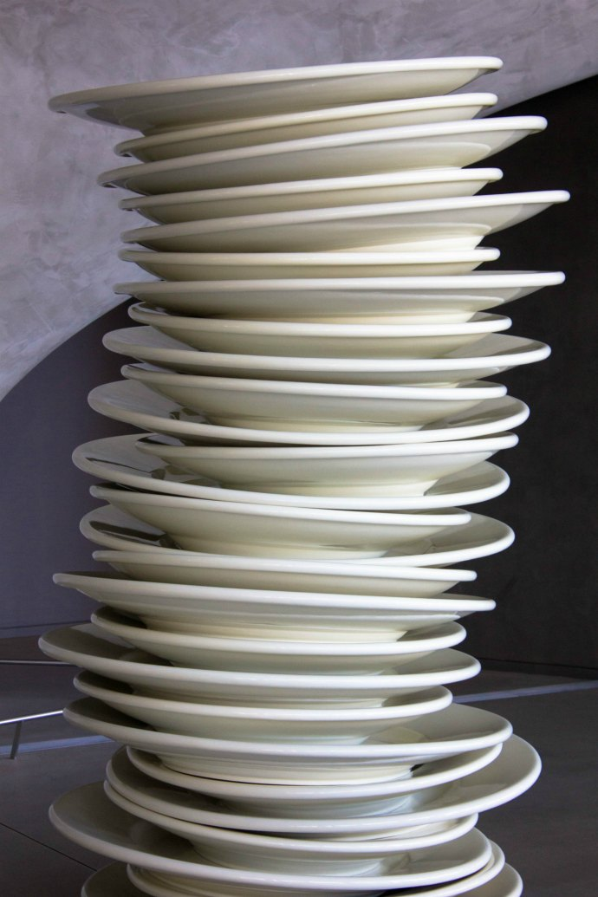

In today's tutorial, we will go over some of the stuff we've already learned in more detail, and add some more new stuff as well.

## 1 More on Lists

All of the methods of the list objects:

- `list.append(x)`: add an item to the end of the list.
- `list.extend(iterable)`: extend the list by appending all the items from the iterable. If you've forgotten about the iterable, see previous tutorials.
- `list.insert(i, x)`: insert an item at a given position. The first argument is the index of the element _before which_ to insert, so `a.insert(0, x)` inserts at the front of the list, and `a.insert(len(a), x)` is equivalent to `a.append(x)` (try to figure this out).
- `list.remove(x)`: remove the _first item from the list whose value is equal to x_.
- `list.pop([i])`: remove the item at the given position in the list and return it. If no index is specified, `a.pop()` removes and returns the last item in the list. (The square brackets around the `i` in the method signature denote that the parameter is optional, not that you should type square brackets at that position. You will see this notation frequently in the Python Library Reference.)
- `list.clear()`: remove all items from the list. Equivalent to del a[:].
- `list.index(x[, start[, end]])`: return zero-based index in the list of the first item whose value is equal to x. The optional arguments start and end are interpreted as in the slice notation and are used to limit the search to a particular subsequence of the list. The returned index is computed relative to the beginning of the full sequence rather than the start argument.
-  `list.count(x)`: return the number of times x appears in the list.
- `list.sort(*, key=None, reverse=False)`: sort the items of the list in place (the arguments can be used for sort customization, see sorted() for their explanation).
- `list.reverse()`: reverse the elements of the list in place.
- `list.copy()`: return a _shallow copy_ (more on this later) of the list.

Examples:

```python
>>> fruits = ['orange', 'apple', 'pear', 'banana', 'kiwi', 'apple', 'banana']
>>> fruits.count('apple')
2
>>> fruits.count('tangerine')
0
>>> fruits.index('banana')
3
>>> fruits.index('banana', 4)  # Find next banana starting a position 4
6
>>> fruits.reverse()
>>> fruits
['banana', 'apple', 'kiwi', 'banana', 'pear', 'apple', 'orange']
>>> fruits.append('grape')
>>> fruits
['banana', 'apple', 'kiwi', 'banana', 'pear', 'apple', 'orange', 'grape']
>>> fruits.sort()
>>> fruits
['apple', 'apple', 'banana', 'banana', 'grape', 'kiwi', 'orange', 'pear']
>>> fruits.pop()
'pear'
```

> You might have noticed that methods like `insert`, `remove`, or `sort` that only modify the list have no return value printed; they return the default `None`. This is a design principle for all mutable data structures in Python.

> Not all data can be sorted or compared. For instance, `[None, 'hello', 10]` doesn't sort because integers can't be compared to strings and None can't be compared to other types.

---

## 2 Stacks (Using Lists as Stacks)

A stack is a data structure where the last added element will be retrieved first ("last-in, first-out".) Think of a pile of plates stacked in a buffet:



In Python, there is no data structure to represent stacks specifically, but we can use lists as stacks.

You put a plate on top of the stack (end of the list,) and you retrieve the last plate you put in the stack first.

To add an item to the top of the stack, use `append()`. To retrieve an item from the top of the stack, use `pop()` without an explicit index. Example:

```python
>>> stack = [3, 4, 5]
>>> stack.append(6)
>>> stack.append(7)
>>> stack
[3, 4, 5, 6, 7]
>>> stack.pop()
7
>>> stack
[3, 4, 5, 6]
>>> stack.pop()
6
>>> stack.pop()
5
>>> stack
[3, 4]
```

Where can we use stack? For a simple example, if we want to reverse a word:

```python
>>> word = 'tiexin'
>>> stack = list(word)
>>> while stack:
...     stack.pop()
...
'n'
'i'
'x'
'e'
'i'
't'
>>>
```

I know this isn't an extremely useful example. We will get back to stack when we meet a concrete problem where the stack would drastically simplify it.

---

## 3 Queues (`collections.deque`)

A queue is a data structure where the first element added is the first element retrieved ("first-in, first-out").

Theoretically, we can use a list for this purpose, but that wouldn't be efficient for this purpose. While appends and pops from the end of the list are fast with O(1) (constant) time complexity, doing inserts or pops from the beginning of a list is slow (because all of the other elements have to be moved by one position.)

In Python, when we need to use a queue, we can use `collections.deque`, which is designed to have fast appends and pops from both ends.

Deque is usually pronounced like "deck," it's short for double-ended queue.

Examples with queues:

```python
>>> from collections import deque
>>> queue = deque(["Eric", "John", "Michael"])
>>> queue.append("Terry")           # Terry arrives
>>> queue.append("Graham")          # Graham arrives
>>> queue.popleft()                 # The first to arrive now leaves
'Eric'
>>> queue.popleft()                 # The second to arrive now leaves
'John'
>>> queue                           # Remaining queue in order of arrival
deque(['Michael', 'Terry', 'Graham'])
```

Again, this example above isn't extremely useful. We will get back to queues when we really need to use them.

---

## 4 List Comprehensions

List comprehensions provide a concise way to create lists.

Common applications are to make new lists where each element is the result of some operations applied to each member of another sequence or iterable or to create a subsequence of those elements that satisfy a certain condition.

For example, assume we want to create a list of squares, like:

```python
>>> squares = []
>>> for x in range(10):
...     squares.append(x**2)
...
>>> squares
[0, 1, 4, 9, 16, 25, 36, 49, 64, 81]
>>> x
9
>>>
```

Note: as shown above, this creates (or overwrites) a variable named x that still exists after the loop completes. Example:

```python
>>> x = 100
>>> squares = []
>>> for x in range(10):
...     squares.append(x**2)
...
>>> squares
[0, 1, 4, 9, 16, 25, 36, 49, 64, 81]
>>> x
9
>>>
```

(Spot the differences.)

We can calculate the list of squares without any side effects, making it more concise and readable:

```python
squares = [x**2 for x in range(10)]
```

Syntax of list comprehension:
- `[]` containing an _expression_,
- followed by a `for` clause,
- then zero or more `for` or `if` clauses.

The result will be a new list resulting from evaluating the expression in the context of the for and if clauses that follow it.

For example, this list comprehension combines the elements of two lists if they are not equal:

```python
>>> [(x, y) for x in [1,2,3] for y in [3,1,4] if x != y]
[(1, 3), (1, 4), (2, 3), (2, 1), (2, 4), (3, 1), (3, 4)]
```

and it's equivalent to:

```python
>>> combs = []
>>> for x in [1,2,3]:
...     for y in [3,1,4]:
...         if x != y:
...             combs.append((x, y))
...
>>> combs
[(1, 3), (1, 4), (2, 3), (2, 1), (2, 4), (3, 1), (3, 4)]
```

Note how the order of the for and if statements is the same in both of these two code snippets. You write a one-liner as if you are writing a multi-line loop.

> If the expression is a tuple (e.g. the (x, y) in the previous example), it must be parenthesized.

```python
>>> vec = [-4, -2, 0, 2, 4]
>>> # create a new list with the values doubled
>>> [x*2 for x in vec]
[-8, -4, 0, 4, 8]
>>> # filter the list to exclude negative numbers
>>> [x for x in vec if x >= 0]
[0, 2, 4]
>>> # apply a function to all the elements
>>> [abs(x) for x in vec]
[4, 2, 0, 2, 4]
>>> # call a method on each element
>>> freshfruit = ['  banana', '  loganberry ', 'passion fruit  ']
>>> [weapon.strip() for weapon in freshfruit]
['banana', 'loganberry', 'passion fruit']
>>> # create a list of 2-tuples like (number, square)
>>> [(x, x**2) for x in range(6)]
[(0, 0), (1, 1), (2, 4), (3, 9), (4, 16), (5, 25)]
>>> # the tuple must be parenthesized, otherwise an error is raised
>>> [x, x**2 for x in range(6)]
  File "<stdin>", line 1
    [x, x**2 for x in range(6)]
     ^^^^^^^
SyntaxError: did you forget parentheses around the comprehension target?
>>> # flatten a list using a listcomp with two 'for'
>>> vec = [[1,2,3], [4,5,6], [7,8,9]]
>>> [num for elem in vec for num in elem]
[1, 2, 3, 4, 5, 6, 7, 8, 9]
```

List comprehensions can contain complex expressions and nested functions:

```python
>>> from math import pi
>>> [str(round(pi, i)) for i in range(1, 6)]
['3.1', '3.14', '3.142', '3.1416', '3.14159']
```

---

## 5 Nested List Comprehensions

The initial expression in a list comprehension can be any arbitrary expression, _including another list comprehension_.

Consider the following example of a 3 x 4 matrix implemented as a list of 3 lists of length 4:

```python
>>> matrix = [
...     [1, 2, 3, 4],
...     [5, 6, 7, 8],
...     [9, 10, 11, 12],
... ]
```

The following list comprehension will _transpose_ rows and columns:

```python
>>> [[row[i] for row in matrix] for i in range(4)]
[[1, 5, 9], [2, 6, 10], [3, 7, 11], [4, 8, 12]]
```

As we saw in the previous section, the nested list comprehebsion is evaluated in the context of the for that follows it, so this example is equivalent to:

```python
>>> transposed = []
>>> for i in range(4):
...     transposed.append([row[i] for row in matrix])
...
>>> transposed
[[1, 5, 9], [2, 6, 10], [3, 7, 11], [4, 8, 12]]
```

which, in turn, is the same as:

```python
>>> transposed = []
>>> for i in range(4):
...     # the following 3 lines implement the nested listcomp
...     transposed_row = []
...     for row in matrix:
...         transposed_row.append(row[i])
...     transposed.append(transposed_row)
...
>>> transposed
[[1, 5, 9], [2, 6, 10], [3, 7, 11], [4, 8, 12]]
```

---

## 6 List Generators

Do you know the difference between the following syntax?

```python
[x for x in range(5)]

(x for x in range(5))
```

The first is list comprehension, and the second is a list generator.

A generator is an iterable, but not a list.

In general:

- use list comprehensions when the result needs to be iterated over multiple times (a generator can only be iterated once), or where speed is paramount (list comprehension creates the list, while the generator returns one element per iteration.)
- use generator expressions where the range is large or infinite (list comprehension creates the list, hence using more memory.)
- use a list if you want to use any of the list methods. For example, the following code won't work:

```python
def gen():
    return (something for something in get_some_stuff())

res = gen()
print res[:2]     # generators don't support indexing or slicing
print [5,6] + res # generators can't be added to lists
```

---

## 7 The `del` Statement

To remove an item from a list given its index instead of its value, use the `del` statement. This differs from the `pop()` method which returns a value. `del` doesn't return anything.

The `del` statement can also be used to remove slices from a list or clear the entire list. Examples:

```python
>>> a = [-1, 1, 66.25, 333, 333, 1234.5]
>>> del a[0]
>>> a
[1, 66.25, 333, 333, 1234.5]
>>> del a[2:4]
>>> a
[1, 66.25, 1234.5]
>>> del a[:]
>>> a
[]
```

`del` can also be used to delete entire variables:

```
>>> del a
```

Referencing the name after this line of code will cause an error because it's as if it's not defined. We will also look at the uses of `del` later.

---

## 8 Tuples and Sequences

In previous tutorials, we have seen that lists and strings have many common properties, such as indexing and slicing operations.

They are two examples of _sequence_ data types.

There is also another sequence data type: the _tuple_. It can be pronounced either like "two pull" (/tupəl/) or tupple (/tʌpəl/), but it seems the latter is more widely used.

A tuple consists of several values separated by commas, for instance:

```python
>>> t = 12345, 54321, 'hello!'
>>> t[0]
12345
>>> t
(12345, 54321, 'hello!')
>>> # Tuples may be nested:
... u = t, (1, 2, 3, 4, 5)
>>> u
((12345, 54321, 'hello!'), (1, 2, 3, 4, 5))
>>> # Tuples are immutable, unlike lists (probably the only difference you should pay attention to)
... t[0] = 88888
Traceback (most recent call last):
  File "<stdin>", line 1, in <module>
TypeError: 'tuple' object does not support item assignment
>>> # but they can contain mutable objects:
... v = ([1, 2, 3], [3, 2, 1])
>>> v
([1, 2, 3], [3, 2, 1])
```

Tuples may seem similar to lists, but they are often used in different situations and for different purposes:

- Tuples are immutable, and usually contain a heterogeneous sequence of elements (elements of different types) that are accessed via unpacking (see later in this section) or indexing (or even by attribute in the case of named tuples).
- Lists are mutable, and their elements are usually homogeneous (of the same type) and are accessed by iterating over the list.

A special problem is the construction of tuples containing 0 or 1 items: the syntax has some extra quirks to accommodate these. Empty tuples are constructed by an empty pair of parentheses; a tuple with one item is constructed by following a value with a comma (it is not sufficient to enclose a single value in parentheses). Ugly, but effective. For example:

```python
>>> empty = ()
>>> singleton = 'hello',    # <-- note trailing comma
>>> len(empty)
0
>>> len(singleton)
1
>>> singleton
('hello',)
```

The statement `t = 12345, 54321, 'hello!'` is an example of tuple packing: the values 12345, 54321, and 'hello!' are packed together in a tuple.

The reverse operation is also possible:

```
>>> x, y, z = t
```

This is called, appropriately enough, sequence unpacking and works for any sequence on the right-hand side. Sequence unpacking requires that there are as many variables on the left side of the equals sign as there are elements in the sequence.

> Note that "multiple assignments" (`a, b = 1, 2) is really just a combination of tuple packing and sequence unpacking.

---

## Summary

OK, today we learned a lot of stuff about the list, and two more new data structures: stack and queue.

In the next chapter, we will look at sets and dictionaries.
