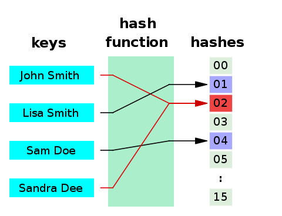

Now that we've mastered lists, let's learn two more data structures that could change your world.

## 1 Sets

A set (same as a mathematical set) is an unordered collection with no duplicate elements.

Basic uses include membership testing (if something is in a group,) and eliminating duplicate entries (for example, if we convert a list to a set, duplicated items are eliminated because there can be no duplicates in a set.)

Set objects also support mathematical operations like union, intersection, difference, and symmetric difference.

To create sets, use curly braces (`{}`) or the `set()` function.

> Note: to create an empty set you have to use `set()`, not `{}`; the latter creates an empty dictionary, a data structure that we discuss in the next section.

A brief demo:

```python
>>> basket = {'apple', 'orange', 'apple', 'pear', 'orange', 'banana'}
>>> print(basket)                      # show that duplicates have been removed
{'orange', 'banana', 'pear', 'apple'}
>>> 'orange' in basket                 # fast membership testing
True
>>> 'crabgrass' in basket
False
>>> # Demonstrate set operations on unique letters from two words
>>> a = set('abracadabra')
>>> b = set('alacazam')
>>> a                                  # unique letters in a
{'a', 'r', 'b', 'c', 'd'}
>>> a - b                              # letters in a but not in b
{'r', 'd', 'b'}
>>> a | b                              # letters in a or b or both
{'a', 'c', 'r', 'd', 'b', 'm', 'z', 'l'}
>>> a & b                              # letters in both a and b
{'a', 'c'}
>>> a ^ b                              # letters in a or b but not both
{'r', 'd', 'b', 'm', 'z', 'l'}
```

Similarly to list comprehensions, set comprehensions are also supported:

```python
>>> a = {x for x in 'abracadabra' if x not in 'abc'}
>>> a
{'r', 'd'}
```

See [a powerful use case of the set here](https://binarysearch.com/problems/Sum-of-Two-Numbers).

A word on set and dictionary: set uses a hashtable as its underlying data structure. So is a dictionary.

A hashtable can map a key to an address in the memory with a function. So, when the key is given, it can get the address in O(1) time:



This explains the O(1) membership checking of a set, since looking up an item in a hashtable is an O(1) operation.

A dict is more or less the same, except it stores a key and the corresponding value with it, but the underlying mechanism is still "hash," and a hash function is any function that can be used to map data of arbitrary size to fixed-size values.

---

## 2 Dictionaries

Another useful data structure is the dictionary.

Unlike sequences (refer to the previous tutorial if you've forgotten about sequences), which are indexed by a range of numbers, dictionaries are indexed by keys, which can be any immutable type; strings and numbers can always be keys. You can't use lists as keys, since lists can be modified in place.

Tuples can be used as keys if they contain only strings, numbers, or tuples because in that case, tuples are immutable; if a tuple contains any mutable object either directly or indirectly, it cannot be used as a key. 

It is best to think of a dictionary as a set of `key: value` pairs, with the requirement that the keys are unique within one dictionary (like a set).

A pair of braces creates an empty dictionary: `{}`.

Placing a comma-separated list of `key: value` pairs within the braces adds initial `key: value` pairs to the dictionary; this is also the way dictionaries are written on output.

The main operations on a dictionary are storing a value with some key and extracting the value given the key. It is also possible to delete a `key: value` pair with `del`. If you store using a key that is already in use, the old value associated with that key is forgotten (the new value overrides the old one for an existing key). When the key doesn't exist, an error would occur.

Performing `list(d)` on a dictionary returns a list of all the keys used in the dictionary, in insertion order (if you want it sorted, just use sorted(d) instead).

Similarly, you can use `values(d)` to get a list of all the values in that dictionary.

To check whether a single key is in the dictionary, use the `in` keyword.

Examples:

```python
>>> tel = {'jack': 4098, 'sape': 4139}
>>> tel['guido'] = 4127
>>> tel
{'jack': 4098, 'sape': 4139, 'guido': 4127}
>>> tel['jack']
4098
>>> del tel['sape']
>>> tel['irv'] = 4127
>>> tel
{'jack': 4098, 'guido': 4127, 'irv': 4127}
>>> list(tel)
['jack', 'guido', 'irv']
>>> sorted(tel)
['guido', 'irv', 'jack']
>>> 'guido' in tel
True
>>> 'jack' not in tel
False
```

The `dict()` constructor builds dictionaries directly from sequences of key-value pairs:

```python
>>> dict([('sape', 4139), ('guido', 4127), ('jack', 4098)])
{'sape': 4139, 'guido': 4127, 'jack': 4098}
```

In addition, dict comprehensions can be used to create dictionaries from arbitrary key and value expressions:

```python
>>> {x: x**2 for x in (2, 4, 6)}
{2: 4, 4: 16, 6: 36}
```

When the keys are simple strings, it is sometimes easier to specify pairs using keyword arguments (note in the example how the keys are not in quotes, although they are strings):

```python
>>> dict(sape=4139, guido=4127, jack=4098)
{'sape': 4139, 'guido': 4127, 'jack': 4098}
```

---

## 3 More on Looping Techniques

Now that we learned sets and dicts, we need to know how to loop through them.

When looping through dictionaries, the key and corresponding value can be retrieved at the same time using the `items()` method:

```python
>>> knights = {'gallahad': 'the pure', 'robin': 'the brave'}
>>> for k, v in knights.items():
...     print(k, v)
...
gallahad the pure
robin the brave
```

When looping through a sequence, the position index and corresponding value can be retrieved at the same time using the `enumerate()` function.

```python
>>> for i, v in enumerate(['tic', 'tac', 'toe']):
...     print(i, v)
...
0 tic
1 tac
2 toe
```

To loop over two or more sequences at the same time, the entries can be paired with the `zip()` function.

```pythoin
>>> questions = ['name', 'quest', 'favorite color']
>>> answers = ['lancelot', 'the holy grail', 'blue']
>>> for q, a in zip(questions, answers):
...     print('What is your {}?  It is {}.'.format(q, a))
...
What is your name?  It is lancelot.
What is your quest?  It is the holy grail.
What is your favorite color?  It is blue.
```

(Also note the string format in the above example.)

To loop over a sequence in reverse, first, specify the sequence in a forward direction and then call the reversed() function.

```python
>>> for i in reversed(range(1, 10, 2)):
...     print(i)
...
9
7
5
3
1
```

To loop over a sequence in sorted order, use the sorted() function which _returns a new sorted list while leaving the source unaltered_:

```python
>>> basket = ['apple', 'orange', 'apple', 'pear', 'orange', 'banana']
>>> for i in sorted(basket):
...     print(i)
...
apple
apple
banana
orange
orange
pear
```

Using `set()` on a sequence eliminates duplicate elements. The use of `sorted()` in combination with `set()` over a sequence is an _idiomatic_ way to loop over unique elements of the sequence in sorted order.

```python
>>> basket = ['apple', 'orange', 'apple', 'pear', 'orange', 'banana']
>>> for f in sorted(set(basket)):
...     print(f)
...
apple
banana
orange
pear
```

It is sometimes tempting to change a list while you are looping over it; however, it is often simpler and safer to create a new list instead.

```python
>>> import math
>>> raw_data = [56.2, float('NaN'), 51.7, 55.3, 52.5, float('NaN'), 47.8]
>>> filtered_data = []
>>> for value in raw_data:
...     if not math.isnan(value):
...         filtered_data.append(value)
...
>>> filtered_data
[56.2, 51.7, 55.3, 52.5, 47.8]
```

---

## 4 More on Conditions

The conditions used in while and if statements can contain _any operators_, not just comparisons (like >, <, ==, etc.).

- The comparison operators `in` and `not in` are _membership tests_ that determine whether a value is in (or not in) a container.
- The operators `is` and `is not` compare whether two objects are really the same object.
- All comparison operators have the same priority, which is lower than that of all numerical operators.

Comparisons can be _chained_. For example, `a < b == c` tests whether a is less than b and b equals c.

Comparisons may be combined using the Boolean operators `and` and `or`, and the outcome of a comparison (or of any other Boolean expression) may be negated with `not`. These have lower priorities than comparison operators; between them, `not` has the highest priority and `or` the lowest, so that `A and not B or C` is equivalent to `(A and (not B)) or C`. Parentheses can be used to express the desired composition.

The Boolean operators `and` and `or` are so-called short-circuit operators: their arguments are evaluated from left to right, and the evaluation stops as soon as the outcome is determined. For example, if A and C are true but B is false, `A and B and C` does not evaluate the expression C.

When used as a general value and not as a Boolean, the return value of a short-circuit operator is the last evaluated argument. It is possible to assign the result of a comparison or other Boolean expression to a variable. For example:

```python
>>> string1, string2, string3 = '', 'Trondheim', 'Hammer Dance'
>>> non_null = string1 or string2 or string3
>>> non_null
'Trondheim'
```

---

## 5 Comparing Sequences and Other Types

Sequence objects typically may be compared to other objects with the same sequence type.

The comparison uses _lexicographical_ ordering:

- first, the first two items are compared, and if they differ this determines the outcome of the comparison;
- if they are equal, the next two items are compared, and so on, until either sequence is exhausted.

If two items to be compared are themselves sequences of the same type, the lexicographical comparison is carried out recursively.

If all items of two sequences compare equally, the sequences are considered equal.

If one sequence is an initial sub-sequence of the other, the shorter sequence is the smaller (lesser) one.

Some examples:

```python
(1, 2, 3)              < (1, 2, 4)
[1, 2, 3]              < [1, 2, 4]
'ABC' < 'C' < 'Pascal' < 'Python'
(1, 2, 3, 4)           < (1, 2, 4)
(1, 2)                 < (1, 2, -1)
(1, 2, 3)             == (1.0, 2.0, 3.0)
(1, 2, ('aa', 'ab'))   < (1, 2, ('abc', 'a'), 4)
```

Note that comparing objects of _different types_ with `<` or `>` is legal if the objects have appropriate comparison methods. For example, mixed numeric types are compared according to their numeric value, so `0` equals `0.0`, etc. Otherwise, the interpreter will raise a TypeError exception.

---

## Summary

Till now, we've covered lists, sets, and dictionaries, which are more or less enough for common programming tasks. There are way more other data structures, though.

We've also seen how to iterate over dicts, sets, and dictionaries, which is important, because programming can solve repeatitive tasks, so using `for` loop over data structures are important.

We've also learned how to use functions to organize your code into shorter and more manageable pieces.

In the next chapter, we will see how to use modules to write even bigger projects.
